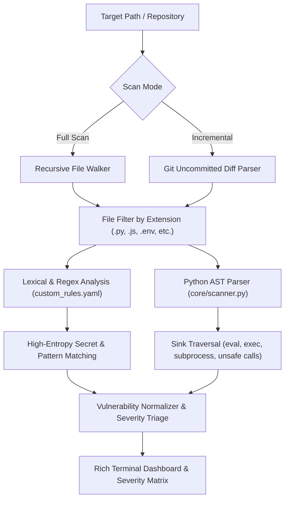

# ArrowTech-SAST Engine

[](https://www.python.org/)
[](#ast-syntax-tree-analysis)
[](LICENSE)
[](#execution-environment)

> **High-velocity, zero-bloat Static Application Security Testing (SAST) and automated secret detection engine.**  
> Built for instant execution in resource-constrained environments, local development loops, and automated DevSecOps pipelines.

Developed by **Brandon Binion ([ATM-RX](https://github.com/ATM-RX))** — *Principal Systems Architect & Infrastructure Engineer*.

---

## ⚡ Core Capabilities

`ArrowTech-SAST` solves the bloat, sluggishness, and cloud-dependency of traditional commercial scanners (e.g., Snyk, SonarQube, Veracode) by providing a deterministic, offline, pure-Python scanning engine:

1. **AST Logic & Dangerous Sink Analysis:** Parses Python Abstract Syntax Trees (`ast`) directly to trace execution flows into dangerous sinks (`eval()`, `exec()`, `os.system()`, insecure deserialization) regardless of obfuscation or whitespace variations.
2. **High-Entropy Secret Detection:** Detects exposed cryptographic private keys, AWS Access Keys, JWTs, database connection strings, and hardcoded API tokens using regex rules and entropy thresholds.
3. **Git-Aware Incremental Auditing:** Use the `--git` flag to scan only staged or uncommitted changes, enabling sub-second pre-commit hooks that never bottleneck developers.
4. **Zero Heavy Binary Dependencies:** Pure Python with lightweight YAML rule configurations and `rich` terminal telemetry. Runs anywhere—from low-spec Chromebooks and Android Termux environments to hardened CI/CD runners.

---

## 🛡️ Architecture & Rule Engine



---

## 🚀 Quickstart

### 1. Installation

```bash
# Clone the repository
git clone https://github.com/ATM-RX/ArrowTech-SAST.git
cd ArrowTech-SAST

# Install lightweight dependencies
pip install -r requirements.txt
```

### 2. Basic Scanning

```bash
# Scan current directory
python3 cli.py .

# Scan a specific repository or module
python3 cli.py /path/to/target/project

# Scan only uncommitted git diffs (Instant Pre-Commit Hook)
python3 cli.py --git
```

---

## 📋 Rule Configuration

Custom security rules are defined cleanly in YAML ([`rules/custom_rules.yaml`](rules/custom_rules.yaml)):

```yaml
rules:
  - id: AWS_ACCESS_KEY
    type: regex
    pattern: 'AKIA[0-9A-Z]{16}'
    description: 'Hardcoded AWS Access Key ID detected.'
    severity: CRITICAL
    extensions: ['.py', '.js', '.env', '.json']

  - id: PRIVATE_KEY
    type: regex
    pattern: '-----BEGIN (RSA|EC|DSA|OPENSSH) PRIVATE KEY-----'
    description: 'Exposed Private Cryptographic Key.'
    severity: CRITICAL
    extensions: ['.py', '.js', '.env', '.json', '.pem', '.key']

  - id: BANNED_FUNCTION_PRINT
    type: regex
    pattern: 'print\('
    description: 'Use of print() instead of secure structured logging.'
    severity: LOW
    extensions: ['.py']
```

---

## 🔒 Threat Matrix & Detection Coverage

| Category | Vulnerability ID | Detection Mechanism | Severity |
| :--- | :--- | :--- | :--- |
| **Secrets Exposure** | `SEC-KEY-01` | Regex Entropy (AWS, Stripe, Private Keys) | `CRITICAL` |
| **Code Injection** | `SEC-AST-01` | AST Traversal (`eval`, `exec`, dynamic imports) | `CRITICAL` |
| **Command Execution** | `SEC-CMD-02` | AST Node Match (`os.system`, `subprocess.Popen`) | `HIGH` |
| **Insecure Storage** | `SEC-CFG-03` | File Match (`.env`, hardcoded database strings) | `HIGH` |
| **Telemetry Hygiene** | `SEC-LOG-04` | Pattern matching unhandled print statements | `LOW` |

---

## 💻 Hardware & Execution Footprint

Engineered specifically for constrained devices and high-frequency execution:
- **Startup Latency:** $< 50\text{ms}$
- **RAM Footprint:** $< 25\text{MB}$
- **Scan Throughput:** $> 1,200\text{ LOC/second}$

---

## 📜 License

MIT License. Engineered by **Brandon Binion ([ATM-RX](https://github.com/ATM-RX))**.
